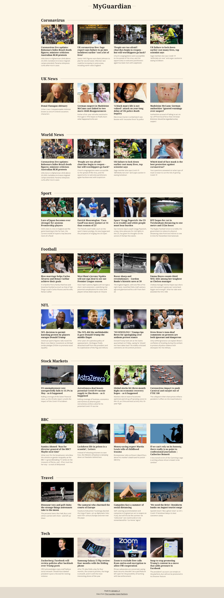

# MyGuardian homepage

This repository contains a personalised homepage app with content supplied by the Guardian open API. It's built with React.js, typescript and uses Cypress to run end-to-end tests. You will need an API key to successfully authenticate against the API. [You can register a developer key here](https://open-platform.theguardian.com/access/).



## Getting Started

```bash
$ git clone https://github.com/matt-harris/react-ts-myguardian.git

$ cd react-ts-myguardian

$ npm install

$ npm start
```

> Open [http://localhost:3000](http://localhost:3000) to see the app running in dev mode.

## Deployment Status

[](https://app.netlify.com/sites/my-guardian/deploys)

## Author

- **Matt Harris** - [matt-harris](https://github.com/matt-harris)

## Data Source

Data API provided by https://open-platform.theguardian.com/
